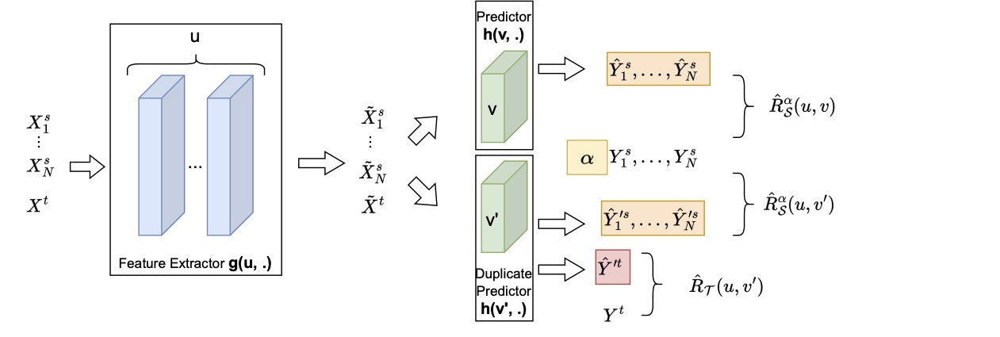
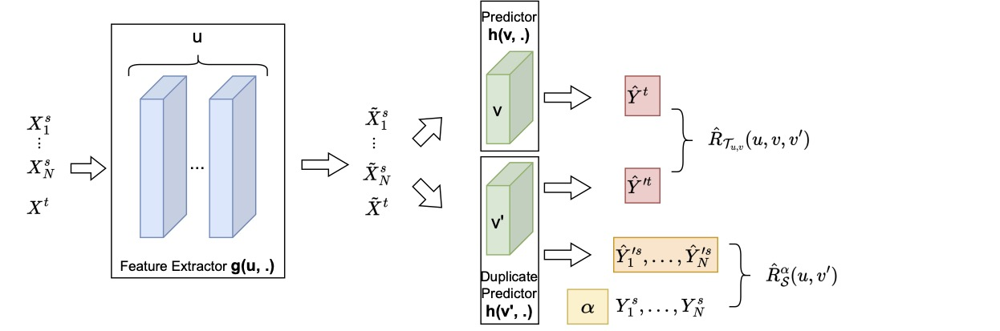

# IMDA

This code repo contains the implementation for the IMDA algorithm presented in the AISTATS 2023 paper:

***Algorithm-Dependent Bounds for Representation Learning of Multi-Source Domain Adaptation*** by Chen and Marchand.


## Prerequisites

To run the code, make sure that the requirements are installed.

```
pip install -r requirements.txt
```

The code was written to run in Python 3.6 or in a more recent version.

## Supervised MDA 
### Model Structure

### Run Experiment
```
python src/main/run_IMDA.py --name "amazon" --transfer_type "sup" --alpha_reg_type "g_norm" --tau 1 --epsilon 1 --gp_coef 1.0  --W1_sup_coef 0.01 --epoch 40 --l2_scale 0.5 --lr 0.5 --drop 0.5
```


## Unsupervised MDA
### Model Structure

### Run Experiment
```
python src/main/run_IMDA.py --name "amazon" --transfer_type "unsup" --alpha_reg_type "g_norm" --tau 0 --epsilon 1 --gp_coef 1.0 --W1_discri_coef1 0.06 --W1_discri_coef2 1.2 --epoch 50 --l2_scale 1 --lr 0.8 --drop 0.5
```


